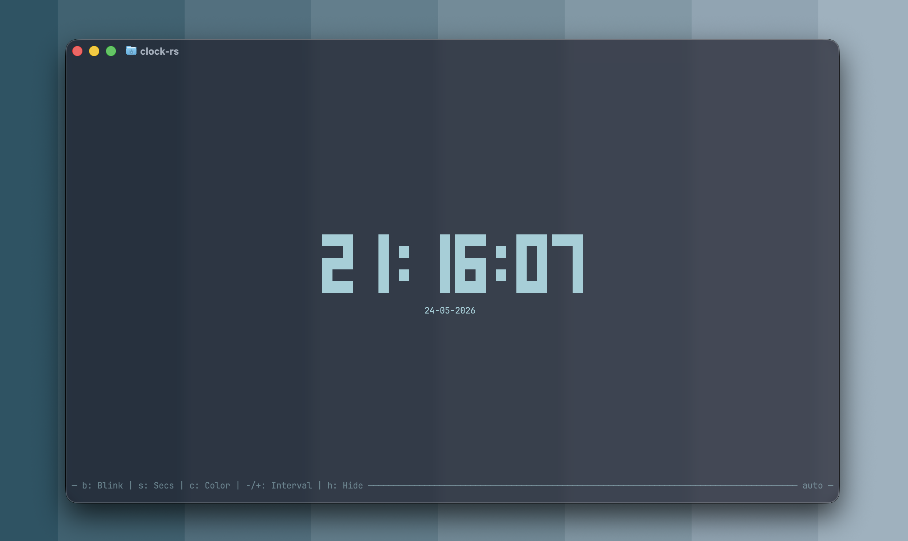

# clock-rs (fork)

> Want a beautifully minimal terminal clock? Use the original: **[Oughie/clock-rs](https://github.com/Oughie/clock-rs)**.
>
> This repo is my personal fork, with the same core but just tweaked for me.
>
> You might like it too, ¯\\\_(ツ)\_/¯



## Install

```sh
cargo install --git https://github.com/DamienBlackwood/clock-rs.git
```

Then run `clock-rs`.

## What's different from the original

The core is the same, but some tiny tweaks have been done. 

See the original repos docs  [here](https://github.com/Oughie/clock-rs/blob/main/README.md) for the full picture!

- **Status bar** at the bottom with live keybind hints (inspired by [mactop](https://github.com/metaspartan/mactop)). Toggle with <kbd>h</kbd>, or launch with `--plain` / `-p` to hide it.
- **Auto interval** — polling interval picks itself: `200ms` when blink is on, `1000ms` otherwise. Set `general.interval` (or pass `-i`) to override.
- **Runtime toggles** for everything that used to be config-only.
- **Auto-save** — runtime tweaks (color, blink, seconds, position, interval, etc.) persist to `conf.toml` on exit. Comments + formatting in your config file are preserved.

### Runtime keys

| Key                                          |Action                                |
| -------------------------------------------- | ------------------------------------- |
| <kbd>h</kbd> / <kbd>H</kbd>                  | Toggle status bar (plain mode)        |
| <kbd>b</kbd> / <kbd>B</kbd>                  | Toggle colon blink                    |
| <kbd>s</kbd> / <kbd>S</kbd>                  | Toggle seconds                        |
| <kbd>c</kbd> / <kbd>C</kbd>                  | Cycle clock color (next / previous)   |
| <kbd>-</kbd> / <kbd>+</kbd>                  | Decrease / increase polling interval  |

Origina keys like (<kbd>P</kbd> pause, <kbd>R</kbd> restart, <kbd>Q</kbd>/<kbd>Esc</kbd>/<kbd>Ctrl+C</kbd> quit, <kbd>Ctrl+R</kbd> reload config) still work.

### New flags

| Flag                | Description                                   |
| ------------------- | --------------------------------------------- |
| `-p`, `--plain`     | Hide the status bar (if you want it like the OG)          |

### Auto interval

Leave `general.interval` out of `conf.toml` (or pass nothing on the CLI) to get the auto behaviour:

- blink on → `200ms` (smooth colon flicker)
- blink off → `1000ms` (1 tick/sec, idle CPU)

However, pressing <kbd>-</kbd> / <kbd>+</kbd> or setting `general.interval`  switches it to manua if you like that.

### Everything else

Color names, date format, timer/stopwatch, all unchanged from the original. See **[docs/ORIGINAL.md](docs/ORIGINAL.md)** or the [upstream repo](https://github.com/Oughie/clock-rs).

## License

Apache 2.0. Original work © 2024 Oughie. Fork modifications © 2026 Damien Blackwood. See [LICENSE](LICENSE).
